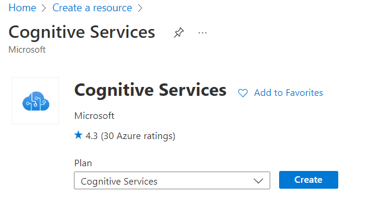
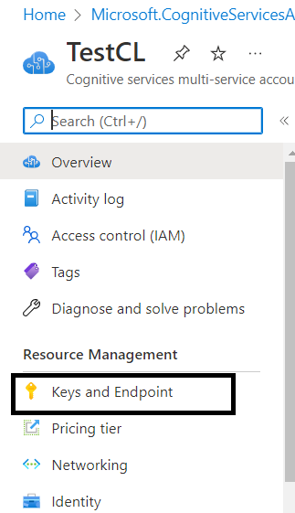
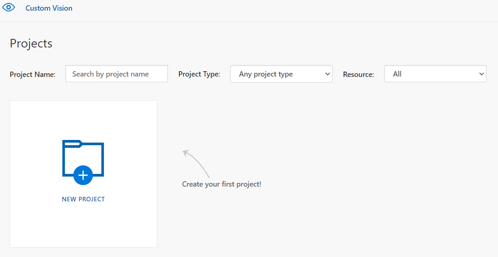
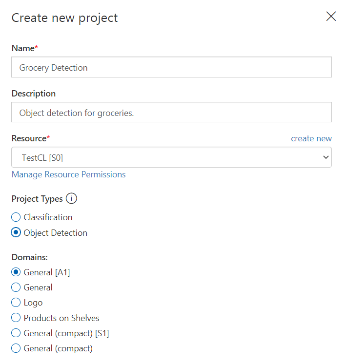
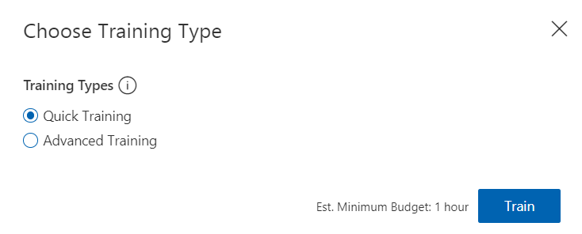
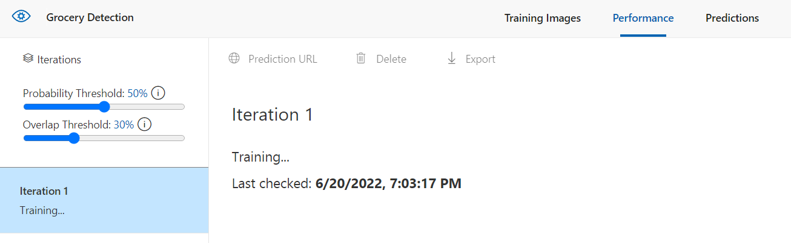
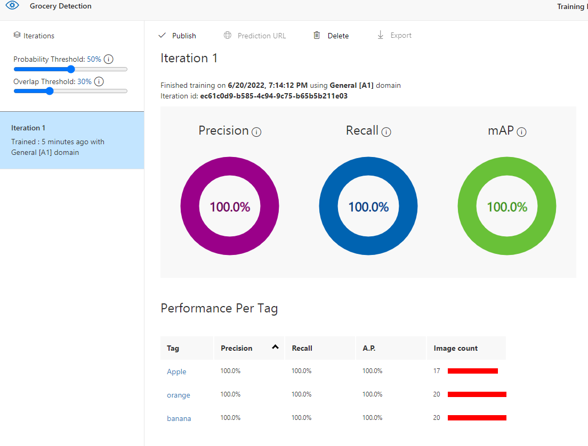
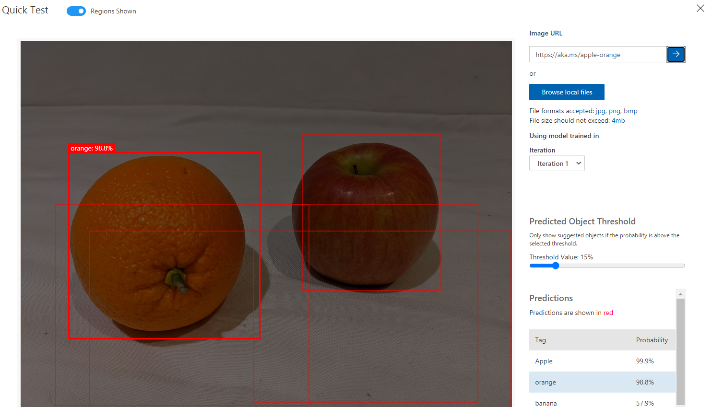
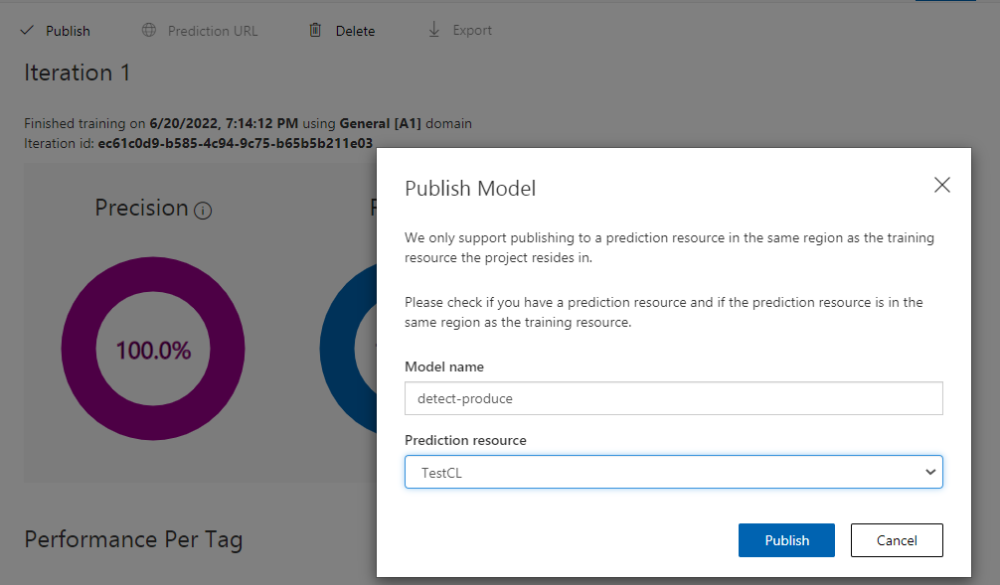

<h1>Introduction</h1>

Object detection is a form of computer vision that utilizes machine-learning to train models capable of recognizing individual types of objects in a single image, or to identify their locations within the image.

<h2> Sample use cases for object detection </h2>

Some sample applications of object detection include:
*	Checking for building safety: Evaluating the safety of a building by analyzing footage of its interior for fire extinguishers or other emergency equipment.
*	Driving assistance: Real-time object detection can play a role in detecting any obstacles on the road, and track lanes to ensure that the vehicle stays within its lanes.
*	Detecting tumors: Models trained can detect any known shapes of potential tumours in medical imaging such as MRI or X-Rays.

<h2> Learning objectives </h2>

Custom Vision service in Azure can help to create an image detection solution with minimal code. In this module you will:

*	Identify services in Azure for creating an object detection solution.
*	Provision a Custom Vision resource.
*	Train an object detection model.
*	Publish and consume an object detection model.

<h1> What is object detection? </h1>

Let's take a look at an example on object detection. Consider the following image below:

A simple object detection model can be used to identify the individual objects located in this image, and draws a bounding box around the identified image like the following:

A model usually returns several information about the object that was identified:
*	The class of each object identified in the image.
*	The probability score of the object classification (which you can interpret as the confidence of the predicted class being correct)
*	The coordinates of a bounding box for each object.

<h2> Note </h2>
<b> Difference beteween Image Classification and Object Detection </b>

Image classification is a form of computer vision that utilizes trained models to categorizes images based on the imagery used for training.

Object detection goes the extra mile to further classify individual objects, and return a set of coordinates that track the location of the object within the image.

<h1>Get started with object detection on Azure</h1>

You can create an object detection machine learning model by using advanced deep learning techniques. However, this approach requires significant expertise and a large volume of training data. The Custom Vision cognitive service in Azure enables you to create object detection models that meet the needs of many computer vision scenarios with minimal deep learning expertise and fewer training images.

<h2> Azure resources for Custom Vision </h2>

Creating an object detection solution with Custom Vision consists of three main tasks.
1. Upload and tag individual images
2. Train the model 
3. Publish the model so that client applications can use it to generate predictions

To create an object detection solution, we must first upload our training images and ag them according to the classifications required (eg. Orange, Apple). Afterwards, we can start training the model using the servivce, and finally publish the model so that client applications can use it to generate predictions.

For each of these tasks, you need a resource in your Azure subscription. 

You can use the following types of resources:

*	Custom Vision: A dedicated resource for the Custom Vision service, which consist of either a training resource, a prediction resource or both. 
*	Cognitive Services: A general cognitive services resource that includes Custom Vision along with many other cognitive services. You can use this type of resource for training, prediction, or both.

Do note that the types of resources are separated into training and prediction. A training resource is a resource used to train your model, whereas a prediction resource is utilized to test your model after the initial learning has completed. 

The separation of training and prediction resources is useful when you want to track resource utilization for model training separately from client applications using the model to predict image classes. However, it can make development of an image classification solution a little confusing.

The simplest approach is to use a general Cognitive Services resource for both training and prediction. This means you would only need to concern yourself with one endpoint (the HTTP address at which your service is hosted) and key (a secret value used by client applications to authenticate themselves).

If you choose to create a Custom Vision resource in Azure, you will be prompted to choose training, prediction, or both - and it's important to note that if you choose "both", then two resources are created - one for training and one for prediction.

It's also possible to take a mix-and-match approach in which you use a dedicated Custom Vision resource for training, but deploy your model to a Cognitive Services resource for prediction. For this to work, the training and prediction resources must be created in the same region.

<h2> Image Tagging </h2>

Before you can train an object detection model, you must tag the classes and bounding box coordinates in a set of training images. This process can be time-consuming, but the <i> Custom Vision </i> portal provides a graphical interface that makes it straightforward. The interface will automatically suggest areas of the image where discrete objects are detected, and you can apply a class label to these suggested bounding boxes or drag to adjust the bounding box area. Additionally, after tagging and training with an initial dataset, the Computer Vision service can use smart tagging to suggest classes and bounding boxes for images you add to the training dataset.

Key considerations when tagging training images for object detection are ensuring that you have sufficient images of the objects in question, preferably from multiple angles; and making sure that the bounding boxes are defined tightly around each object.

<h2> Model Training and Evaluation </h2>

To train the model, you can use the Custom Vision portal, or through one of Custom Vision’s programming language-specific Software Development Kits (SDKs). Training an object detection model can take some time, depending on the number of training images, classes, and objects within each image.

Model training process is an iterative process in which the Custom Vision service repeatedly trains the model using some of the data, but holds some back to evaluate the model. At the end of the training process, the performance for the trained model is indicated by the following evaluation metrics:

*	<b>Precision</b>: What percentage of class predictions did the model correctly identify? For example, if the model predicted that 10 images are oranges, of which eight were actually oranges, then the precision is 0.8 (80%).
* Recall: What percentage of the class predictions made by the model were correct? For example, if there are 10 images of apples, and the model found 7 of them, then the recall is 0.7 (70%).
*	Mean Average Precision (mAP): An overall metric that takes into account both precision and recall across all classes.

<h2> Using the model for Prediction </h2>

After you've trained the model, and you're satisfied with its evaluated performance, you can publish the model to your prediction resource. When you publish the model, you can assign it a name. The default name provided is “IterationX”, where X is the number of times the model has been trained.

To use you model, client application developers need the following information:
*	Project ID: The unique ID of the Custom Vision project you created to train the model.
*	Model name: The name you assigned to the model during publishing.
*	Prediction endpoint: The HTTP address of the endpoints for the prediction resource to which you published the model (not the training resource).
*	Prediction key: The authentication key for the prediction resource to which you published the model (not the training resource).

<h1> Knowledge Check </h1>

1. Which of the following results does an object detection model typically return for an image?
    * A class label and probability score for the image
    * Bounding box coordinates that indicates the region of the image where all of the objects it contains are located
    * A class label, probability, and bounding box for each object in the image
     
     
2. You plan to use a set of images to train an object detection model, and then publish the model as a predictive service. You want to use a single Azure resource with the same key and endpoint for training and prediction. What kind of Azure resource should you create?
    * Cognitive Services
    * Custom Vision
    * Computer Vision
     
     
3. What are some sample use cases of Object Detection?
    * Checking for building safety
    * Detecting tumors
    * Automated calls
    * Voice assistants
     
     
4. What are some of the steps required to create an Object Detection solution?
    * Upload and tag individual images
    * Publish the model so that client applications can use it to generate predictions
    * Train the model
    * All of the above
     
     
<h1> Exercise - Create an object detection solution </h1>

<b>Object detection</b> is a form of computer vision in which a machine learning model is trained to classify individual instances of objects in an image, and indicate a <i>bounding box</i> that marks its location. 

You can think of this as a progression from image classification (in which the model answers the question "what is this an image of?") to building solutions where we can ask the model "what objects are in this image, and where are they?".

For example, a grocery store might use an object detection model to implement an automated checkout system that scans a conveyor belt using a camera, and can identify specific items without the need to place each item on the belt and scan them individually.

The <b>Custom Vision</b> cognitive service in Microsoft Azure provides a cloud-based solution for creating and publishing custom object detection models. In Azure, you can use the Custom Vision service to train an image classification model based on existing images. There are two elements to creating an image classification solution. First, you must train a model to recognize different classes using existing images. Then, after the model is trained, you publish it as a service that can be consumed by applications.

To test the capabilities of the Custom Vision service to detect objects in images, we'll use a simple command-line application that runs in the Cloud Shell. The same principles and functionality apply in real-world solutions, such as web sites or phone apps.

<h2> Creating a Cognitive Services resource </h2>

You can use the Custom Vision service by creating either a Custom Vision resource or a Cognitive Services resource.

<b>Note</b>

Not every resource is available in every region. Whether you create a Custom Vision or Cognitive Services resource, only resources created in certain regions can be used to access Custom Vision services. For simplicity, a region is pre-selected for you in the configuration instructions below.

Create a <b>Cognitive Services</b> resource in your Azure subscription.

1. In another browser tab, open the Azure portal at https://portal.azure.com, signing in with your Microsoft account.

2. Click the <b>＋Create a resource</b> button, search for Cognitive Services, and create a Cognitive Services resource with the following settings:

    * Subscription: Your Azure subscription.
    * Resource group: Select or create a resource group with a unique name.
    * Region: East US
    * Name: Enter a unique name.
    * Pricing tier: S0
    * <b>I confirm I have read and understood the notices: Selected.</b>
     
     
  

3. Review and create the resource, and wait for deployment to complete. Then go to the deployed resource.

4. View the Keys and Endpoint page for your Cognitive Services resource. You will need the endpoint and keys to connect from client applications.

    
 
<h2>Creating a Custom Vision project</h2>

To train an object detection model, you need to create a Custom Vision project based on your training resource. To do this, you'll use the Custom Vision portal.

1. In a new browser tab, open the Custom Vision portal at https://customvision.ai, and sign in using the Microsoft account associated with your Azure subscription.

    

2. Create a new project with the following settings:

    * Name: Grocery Detection
    * Description: Object detection for groceries.
    * Resource: The resource you created previously
    * Project Types: Object Detection
    * Domains: General
     
     
    

3. Wait for the project to be created and opened in the browser.

<h2> Add and Tag images </h2>

To train an object detection model, you need to upload images that contain the classes you want the model to identify, and tag them to indicate bounding boxes for each object instance.

1. Download and extract the training images from https://aka.ms/fruit-objects. The extracted folder contains a collection of images of fruit.

2. In the Custom Vision portal https://customvision.ai, make sure you are working in your object detection project Grocery Detection. Then select <b>Add images</b> and upload all of the images in the extracted folder.

    

3. After the images have been uploaded, select the first one to open it.

4. Hold the mouse over any object in the image until an automatically detected region is displayed like the image below. Then select the object, and if necessary resize the region to surround it.

    

    Alternatively, you can simply drag around the object to create a region.

5. When the region surrounds the object, add a new tag with the appropriate object type (apple, banana, or orange) as shown here:

    

6. Select and tag each other object in the image, resizing the regions and adding new tags as required.

    

7. Use the > link on the right to go to the next image, and tag its objects. Then just keep working through the entire image collection, tagging each apple, banana, and orange.

8. When you have finished tagging the last image, close the <b>Image Detail</b> editor and on the <b>Training Images</b> page, under <b>Tags</b>, select <b>Tagged</b> to see all of your tagged images:

    

<h1> Train and test a model </h1>
Now that you've tagged the images in your project, you're ready to train a model.

1. In the Custom Vision project, click Train to train an object detection model using the tagged images. Select the Quick Training option.

    

2. Wait for training to complete (it might take ten minutes or so), and then review the Precision, Recall, and mAP performance metrics - these measure the prediction goodness of the object detection model, and should all be high.

    
    

3. At the top right of the page, click Quick Test, and then in the Image URL box, enter https://aka.ms/apple-orange and view the prediction that is generated. Then close the Quick Test window.

    

<h1> Publish the Object Detection model </h1>

Now you're ready to publish your trained model and use it from a client application.

1. Click 🗸 Publish to publish the trained model with the following settings:
    * Model name: detect-produce
    * Prediction Resource: The resource you created previously.
     
     
  

2. After publishing, click the Prediction URL (🌐) icon to see information required to use the published model. Later, you will need the appropriate URL and Prediction-Key values to get a prediction from an Image URL, so keep this dialog box open and carry on to the next task.

<h1> Run Cloud Shell </h1>

To test the capabilities of the Custom Vision service, we'll use a simple command-line application that runs in the Cloud Shell on Azure.

1. In the Azure portal, select the [>_] (Cloud Shell) button at the top of the page to the right of the search box. This opens a Cloud Shell pane at the bottom of the portal.

    

2. The first time you open the Cloud Shell, you may be prompted to choose the type of shell you want to use (Bash or PowerShell). Select <b>PowerShell.</b> If you do not see this option, skip the step.

3. If you are prompted to create storage for your Cloud Shell, ensure your subscription is specified and select Create storage. Then wait a minute or so for the storage to be created.

    

4. Make sure the type of shell indicated on the top left of the Cloud Shell pane is switched to <b>PowerShell</b>. If it is Bash, switch to PowerShell by using the drop-down menu.

    

5. Wait for PowerShell to start. You should see the following screen in the Azure portal:

    

<h1>Configure and run a client application</h1>

Now that you have a custom model, you can run a simple client application that uses the Custom Vision service to detect objects in an image.

1. In the command shell, enter the following command to download the sample application and save it to a folder called ai-900.

    <code>git clone https://github.com/MicrosoftLearning/AI-900-AIFundamentals ai-900</code>
     
     
    <b>Note</b>

    If you already used this command in another lab to clone the ai-900 repository, you can skip this step.

2. The files are downloaded to a folder named ai-900. Now we want to see all of the files in your Cloud Shell storage and work with them. Type the following command into the shell:

    <code>code . </code>
     
     
    Notice how this opens up an editor like the one in the image below:

    

3. In the Files pane on the left, expand ai-900 and select detect-objects.ps1. This file contains some code that uses the Custom Vision service to detect objects an image, as shown here:

    

4. Don't worry too much about the details of the code, the important thing is that it needs the prediction URL and key for your Custom Vision model when using an image URL.

    Get the prediction URL from the dialog box in your Custom Vision project.

    <b>Note</b>

    Remember, you reviewed the prediction URL after you published the image classification model. To find the prediction URL, navigate to the Performance tab in your project, then click on Prediction URL (if the screen is compressed, you may just see a globe icon). A dialogue box will appear. Copy the url for If you have an image URL. Paste it into the code editor, replacing YOUR_PREDICTION_URL.

    Using the same dialog box, get the prediction key. Copy the prediction key displayed after Set Prediction-Key Header to. Paste it in the code editor, replacing the YOUR_PREDICTION_KEY placeholder value.

    

    After pasting the Prediction URL and Prediction Key values, the first two lines of code should look similar to this:

    <code>
    $predictionUrl="https..."
     
    $predictionKey ="1a2b3c4d5e6f7g8h9i0j...."
    </code>
     
     
5. At the top right of the editor pane, use the ... button to open the menu and select Save to save your changes. Then open the menu again and select Close Editor.

    You will use the sample client application to detect objects in this image:

    

6. In the PowerShell pane, enter the following command to run the code:

    <code>
    cd ai-900
     
    ./detect-objects.ps1 
    </code>
     
     
7. Review the prediction, which should be apple orange banana*.

<h1> Clean-up </h1>
It's a good idea at the end of a project to identify whether you still need the resources you created. Resources left running can cost you money.
 
 
If you are continuing on to other modules in this learning path you can keep your resources for use in other labs.

If you have finished learning, you can delete the resource group or individual resources from your Azure subscription:

In the Azure portal, in the Resource groups page, open the resource group you specified when creating your resource.

Click Delete resource group, type the resource group name to confirm you want to delete it, and select Delete. You can also choose to delete individual resources by selecting the resource(s), clicking on the three dots to see more options, and clicking Delete.

<h1> Learn more </h1>

This simple app shows only some of the capabilities of the Custom Vision service. To learn more about what you can do with this service, see the [Custom Vision page](https://azure.microsoft.com/services/cognitive-services/custom-vision-service/).

<h1> Summary </h1>

Detecting objects in images has proven a key element in many applications that help improve safety, provide better medical imaging diagnostics, manage stock levels for inventory management, and even help preserve wildlife. The object detection capabilities in the Custom Vision service make is easy to develop models to support these kinds of scenario.

You can find out more about the Custom Vision service in the service documentation.
